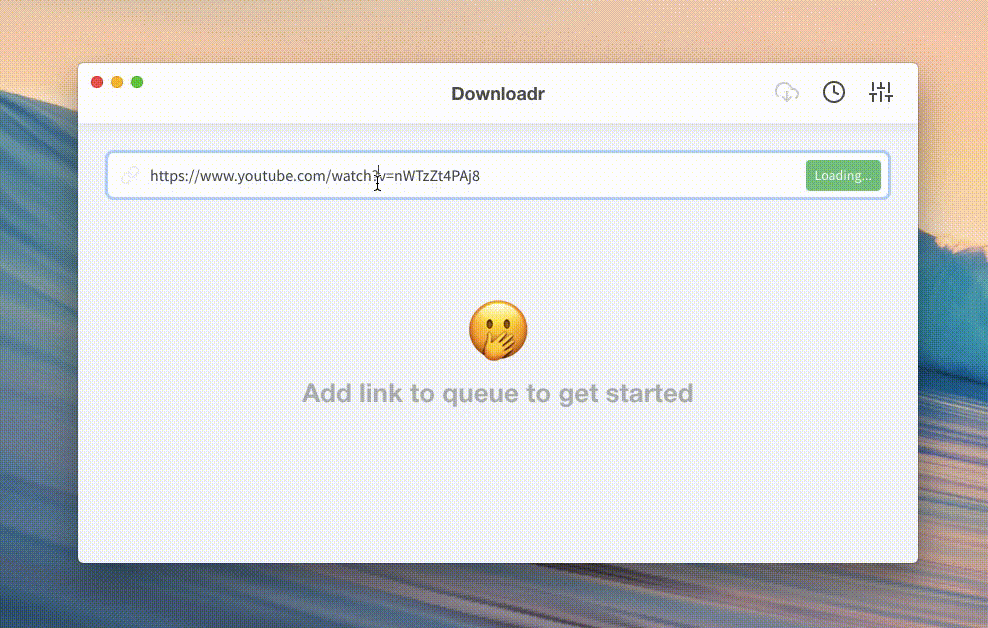

<h2 align=center>Downloadr</h2>
<p align="center">

<a hre="https://github.com/SimulatedGREG/electron-vue/"></a>
</p>

A simple video downloader based on [youtube-dl](https://github.com/ytdl-org/youtube-dl/), [vuejs](https://github.com/vuejs/vue) and [electron](https://github.com/electron/electron).



:warning: This isn't a stable version. There is a list of [tasks to be done](https://github.com/Wallerand/Downloadr/projects/1) before release.

#### Build Setup

```bash
# install dependencies
npm install

# serve with hot reload at localhost:9080
npm run dev

# build electron application for production
npm run build
```
